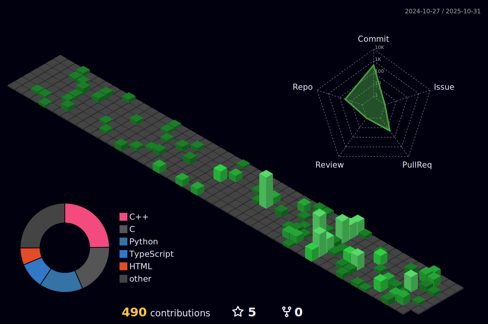

  

  

---

# About Me

I'm a **Software Developer** building real-world solutions through code. I try to find the optimal way to solve the problems. I believe that if you know the problem, you know the Solution.

# Areas of Expertise
> Following are the areas of tech in which I have experience in and have built projects:

## 1. Full Stack Web Development
* Front End (Next.js UI, TypeScript, Tailwind CSS, Shadcn UI Components)
* Back End (Node.js, Flask, FastAPI, Next.js API Routes, NextJs Server Actions)
* Databases (MySQL, SQLite, Firebase, MongoDB, Firestore)
* Authentication (NextAuth.js, JWT, OAuth)

## 2. Machine Learning & AI
* Data Analysis & Visualization (Pandas, NumPy, Matplotlib, Seaborn)
* Machine Learning Models (Scikit-Learn, TensorFlow, Keras)
* Retrieval-Augmented Generation (RAG) using LangChain, Hugging Face, Chromadb
* Agentic AI Systems (Langgraph Agents, Tool Use, Custom Prompts)
* LLM API Integration (OpenAI, Hugging Face, Gemini)
* Vector Stores (ChromaDB, Weaviate)
* Local Ollama LLM Integration

## 3. Mobile App Development
* Android Apps using Kotlin, Jetpack Compose, ML Kit, TensorFlow Lite
* Cross-Platform Apps using React Native
* Firebase Integration (Auth, Firestore, Realtime DB, Cloud Functions)
* Integrate AI/ML Models into Mobile Apps (TensorFlow Lite, ML Kit)
* Sensor Integration and Real-time Data with Kotlin

---

# Portfolio Projects

  <a href="https://github.com/Maaz-319/event_booking_platform" target="_blank" style="text-decoration: none;">
    

      <h3 style="
        margin: 0 0 8px 0;
        font-size: 18px;
        font-weight: 600;
        letter-spacing: 0.3px;
        color: #f8fafc;
      ">
        Event Booking Platform <a href="https://deveventsapp.netlify.app/" target="_blank" style="color: #00FFAA; margin-left: 10px; text-decoration: none;">Visit Live ↗️</a>
      </h3>
      

        A full-stack web application for booking events, built with Next.js, Tailwind CSS, Node.js, and MySQL. Features user authentication, event management, and real-time booking updates.
      

      

        <strong>Tech Stack:</strong> <code>Next.js</code> <code>Tailwind CSS</code> <code>MongoDB</code> <code>NextJs Server Actions</code> <code>Clerk Auth</code>
      

    

  </a>

  <a href="https://www.linkedin.com/posts/maazbinasif_%F0%9D%90%99%F0%9D%90%9A%F0%9D%90%A9%F0%9D%90%A5%F0%9D%90%B2-%F0%9D%90%82%F0%9D%90%A1%F0%9D%90%9A%F0%9D%90%AD-%F0%9D%90%80%F0%9D%90%A7%F0%9D%90%9D%F0%9D%90%AB%F0%9D%90%A8%F0%9D%90%A2%F0%9D%90%9D-%F0%9D%90%80%F0%9D%90%A9%F0%9D%90%A9-activity-7374465665635762176-hLlU?utm_source=social_share_send&utm_medium=member_desktop_web&rcm=ACoAAFDDV0UBkcz9n13uXiiuhQBkLb0QTpwMHcI" target="_blank" style="text-decoration: none;">
    

      <h3 style="
        margin: 0 0 8px 0;
        font-size: 18px;
        font-weight: 600;
        letter-spacing: 0.3px;
        color: #f8fafc;
      ">
        Zaply Chat - Android based Secure Chat App
      </h3>
      

        An Android chat application built with Kotlin and Firebase, featuring real-time messaging and end-to-end encryption for secure communication.
      

      

        <strong>Tech Stack:</strong> <code>Kotlin</code> <code>Firebase</code> <code>Android Studio</code> <code>End-to-End Encryption</code>
      

    

  </a>

  <a href="https://github.com/Maaz-319/Note-it" target="_blank" style="text-decoration: none;">
    

      <h3 style="
        margin: 0 0 8px 0;
        font-size: 18px;
        font-weight: 600;
        letter-spacing: 0.3px;
        color: #f8fafc;
      ">
        Note it - Android Note Taking App
      </h3>
      

        An Android note-taking application built with Kotlin, user-friendly interface and jetpack components, Using Room Database for local storage.
      

      

        <strong>Tech Stack:</strong> <code>Kotlin</code> <code>Room DB</code> <code>Android Studio</code> <code>Jetpack Components</code>
      

    

  </a>

  <h1 style="margin-top: 20px; background-color: #0f172a; padding: 10px; border-radius: 8px;"> Visit <a href="https://maazai.netlify.app/">My Portfolio</a> for more! </h1>

---

# Other Areas I have Worked On

* AI-powered apps (Python, LangChain, Hugging Face, RAG)

  1. Interview Agent [GitHub Repo](https://github.com/Maaz-319/langgraph_interview_agent)
  2. RAG based Chatbot using Gemini LLM and Chroma DB [GitHub Repo](https://github.com/Maaz-319/rag_using_local_vector_store)
  3. AI powered suggestions in a blogging platform [GitHub Repo](https://github.com/Maaz-319/blog_full_stack)

* 2D Game Dev with PyGame

  1. Racing Furry Game [GitHub Repo](https://github.com/Maaz-319/Python/tree/main/PyGame/Racing%20Furry)
  2. Space Invaders Game [GitHub Repo](https://github.com/Maaz-319/Space-Invasion-v2.0)
  3. Flappy Bird Clone [GitHub Repo](https://github.com/Maaz-319/Flappy-Bird-Clone)

* Desktop Apps (Python, C/C++, OOP Design)

  1. POS with MySQL based storage and Reporting Capabilities  [GitHub Repo](https://github.com/Maaz-319/Point-of-Sale-System)
  2. RSA Message Encryptor/Decryptor  [GitHub Repo](https://github.com/Maaz-319/RSA-Encryption)
  3. Library Management System  [GitHub Repo](https://github.com/Maaz-319/Library-Management-System)
  4. Bank Management System  [GitHub Repo](https://github.com/Maaz-319/Bank-Management-System/tree/main/GUI)
  5. Audio Player using PyGame  [GitHub Repo](https://github.com/Maaz-319/audioplayer)

---

# Tech Stack

## Languages

  <code style="padding: 4px">Python</code>
  <code style="padding: 4px">C/C++</code>
  <code style="padding: 4px">Assembly (x86 / Inline ASM)</code>
  <code style="padding: 4px">JavaScript</code>
  <code style="padding: 4px">TypeScript</code>
  <code style="padding: 4px">Kotlin</code>
  <code style="padding: 4px">HTML</code>
  <code style="padding: 4px">CSS</code>
  <code style="padding: 4px">SQL</code>

## Frameworks & Libraries

  <code style="padding: 4px">TensorFlow</code>
  <code style="padding: 4px">Keras</code>
  <code style="padding: 4px">PyTorch</code>
  <code style="padding: 4px">Scikit-learn</code>
  <code style="padding: 4px">Pandas</code>
  <code style="padding: 4px">React</code>
  <code style="padding: 4px">Next.js</code>
  <code style="padding: 4px">React Native</code>
  <code style="padding: 4px">jQuery</code>
  <code style="padding: 4px">Tailwind CSS</code>

## AI / ML / Agentic Systems

  <code style="padding: 4px">Machine Learning</code>
  <code style="padding: 4px">Deep Learning</code>
  <code style="padding: 4px">Agentic AI Workflows</code>
  <code style="padding: 4px">Retrieval-Augmented Generation (RAG)</code>
  <code style="padding: 4px">LLM Integration</code>
  <code style="padding: 4px">Embedding-based Search</code>

## Databases & Storage

  <code style="padding: 4px">SQLite</code>
  <code style="padding: 4px">MySQL</code>
  <code style="padding: 4px">Oracle DB</code>
  <code style="padding: 4px">MongoDB</code>
  <code style="padding: 4px">Firebase Realtime DB</code>
  <code style="padding: 4px">Firestore</code>

## Backend / Cloud / Auth

  <code style="padding: 4px">Firebase</code>
  <code style="padding: 4px">Firebase Auth</code>
  <code style="padding: 4px">Clerk Auth</code>
  <code style="padding: 4px">Flask</code>
  <code style="padding: 4px">FastAPI</code>

## Developer Tools

  <code style="padding: 4px">Git</code>
  <code style="padding: 4px">GitHub</code>
  <code style="padding: 4px">Docker</code>
  <code style="padding: 4px">Postman</code>
  <code style="padding: 4px">Android Studio</code>
  <code style="padding: 4px">VS Code</code>
  <code style="padding: 4px">PyCharm</code>

## Operating Systems & Environments

  <code style="padding: 4px">Linux</code>
  <code style="padding: 4px">Ubuntu</code>
  <code style="padding: 4px">Kali Linux</code>
  <code style="padding: 4px">Parrot OS</code>
  <code style="padding: 4px">Tails OS</code>

## Mobile & Platform Development

  <code style="padding: 4px">Android (Kotlin)</code>
  <code style="padding: 4px">On-device ML</code>
  <code style="padding: 4px">Camera & Sensor APIs</code>
  <code style="padding: 4px">Offline-first Applications</code>

## Low-Level & Systems (Distinctive Skillset)

  <code style="padding: 4px">Inline Assembly</code>
  <code style="padding: 4px">x86 Instruction Set</code>
  <code style="padding: 4px">Memory & Registers</code>
  <code style="padding: 4px">Arduino</code>

# Engineering Focus

I focus on building <strong>clean, scalable systems</strong> with an emphasis on:

<ul>
  <li>Automation-first workflows</li>
  <li>Readable and maintainable architectures</li>
  <li>Performance-aware design</li>
  <li>Practical AI systems, not demos</li>
</ul>

---

# GitHub Activity Graph

  

## Trophies

  

---

# Connect with Me

  

  

  

  

  

  <a href="https://facebook.com/maaz.binaasif" target="_blank"> 

  

